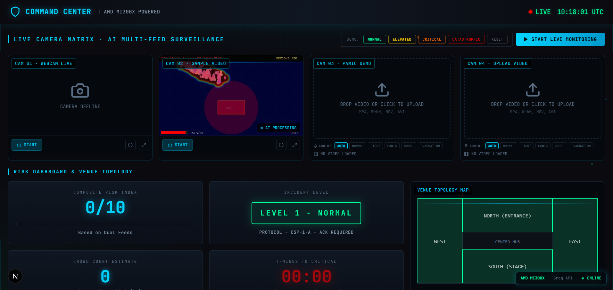
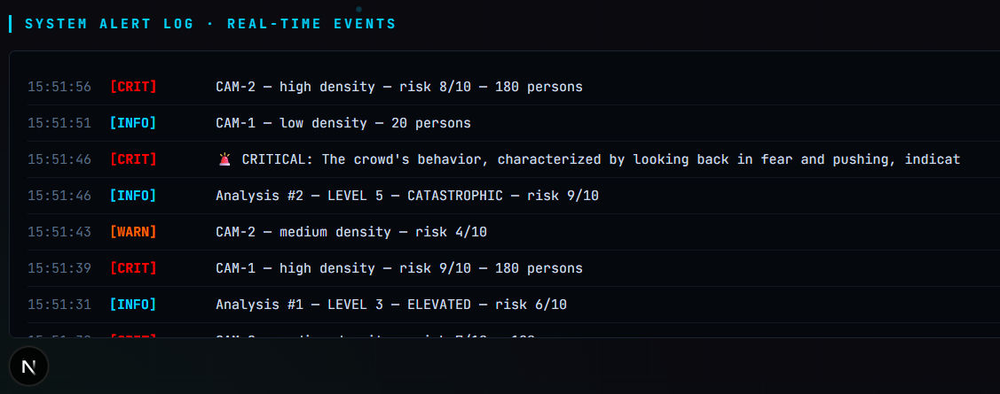
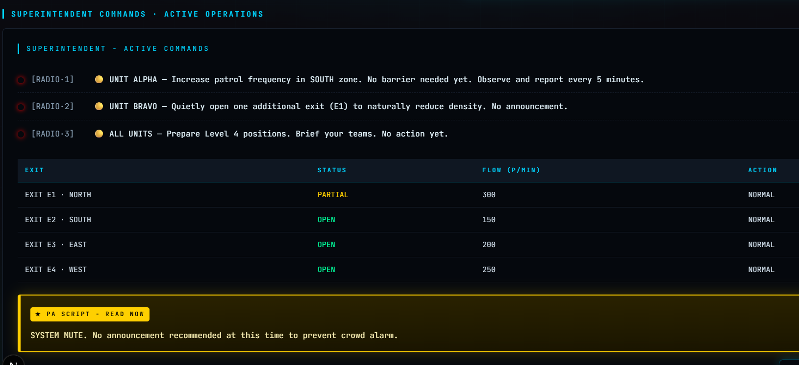

# CrowdSense AI — Real-Time Crowd Safety Intelligence System

> **Hackathon Project** — AI-powered crowd monitoring that detects danger before it becomes a disaster.

CrowdSense AI is a real-time crowd safety platform that uses multimodal AI (vision + audio) to analyze live camera feeds, detect crowd crush risks, and generate actionable superintendent commands — all in under 10 seconds.

---

## Screenshots

> Add screenshots to the `/screenshots` folder and they will appear here.

| Dashboard Overview | Risk Escalation | Superintendent Commands |
|---|---|---|
|  |  |  |

---

## What It Does

- **Live crowd analysis** — Llama 4 Scout 17B vision model reads camera frames and counts people, detects density, movement patterns, bottlenecks, and distress signs
- **Audio intelligence** — OpenAI Whisper transcribes crowd audio in real time, detecting panic words ("help", "crush", "stop pushing") and screaming
- **Dual-model reasoning** — Junior analyst (Llama 3.1 8B) makes an initial risk assessment, Senior critic challenges and refines it
- **Superintendent commands** — Generates specific radio commands for security officers (Unit Alpha, Bravo, Charlie...) based on venue layout and crowd physics
- **5-level incident protocol** — Escalates from Level 1 (normal) to Level 5 (catastrophic evacuation) with appropriate PA scripts and emergency service calls
- **Demo scenarios** — One-click injection of Normal / Elevated / Critical / Catastrophic crowd scenarios for live demonstration

---

## Tech Stack

| Layer | Technology |
|---|---|
| **Frontend** | Next.js 15, TypeScript, Tailwind CSS, Framer Motion |
| **Backend** | Python 3.13, FastAPI, Uvicorn |
| **Vision AI** | Llama 4 Scout 17B (Groq) — multimodal crowd frame analysis |
| **Reasoning AI** | Llama 3.1 8B Instant (Groq) — junior analyst + senior critic |
| **Audio AI** | OpenAI Whisper (local CPU) — speech transcription |
| **Video Processing** | OpenCV, imageio-ffmpeg |
| **GPU Ready** | AMD MI300X — switch via `AI_PROVIDER=amd` in `.env` |

---

## Architecture

```
Camera Feeds (4x)
    │
    ▼
Vision Layer ──────────────────────────────────────────────┐
(Llama 4 Scout 17B)                                        │
    │                                                       │
    ▼                                                       ▼
Audio Layer                                          Fusion Layer
(Whisper small)                                  (Vision + Audio)
    │                                                       │
    └───────────────────────────────────────────────────────┘
                                                            │
                                                            ▼
                                                   Junior Analyst
                                                (Llama 3.1 8B — initial risk)
                                                            │
                                                            ▼
                                                   Senior Critic
                                                (Llama 3.1 8B — refines & challenges)
                                                            │
                                                            ▼
                                              Superintendent Commands
                                           (Unit orders, exit routing, PA script)
                                                            │
                                                            ▼
                                                  Next.js Dashboard
                                              (Real-time polling every 2s)
```

---

## Setup

### Prerequisites

- Python 3.10+
- Node.js 18+
- A free [Groq API key](https://console.groq.com) (no credit card required)

### 1. Clone the repo

```bash
git clone https://github.com/sonusuhana754-ui/crowdsense-ai.git
cd crowdsense-ai
```

### 2. Install backend dependencies

```bash
pip install fastapi uvicorn python-multipart opencv-python-headless requests python-dotenv openai-whisper "imageio[ffmpeg]" numpy scipy pyttsx3
```

### 3. Configure API key

Create a `.env` file in the project root:

```env
AI_PROVIDER=groq
GROQ_API_KEY=your_groq_api_key_here
WHISPER_MODEL=small
```

Get your free key at [console.groq.com](https://console.groq.com) → API Keys → Create API Key.

### 4. Generate the demo panic video

```bash
python demo/generate_panic_sample.py
```

This creates `demo/panic_crowd.mp4` — a 12-second synthetic crowd video showing calm → converging → panic → crush, with real TTS panic audio embedded.

### 5. Start the backend

```bash
uvicorn backend.main:app --host 127.0.0.1 --port 8080 --reload
```

### 6. Install and start the frontend

```bash
cd frontend
npm install
npm run dev
```

### 7. Open the dashboard

Navigate to [http://localhost:3000/dashboard](http://localhost:3000/dashboard)

---

## ⚡ Quick Demo (No Setup Required)

> **Don't have a Groq API key yet?** You can still see the full system in action using the built-in demo mode.

Once the backend is running, click the **"▶ Run Full Demo"** button at the top of the dashboard.

The demo runs a 4-step escalating sequence — each step calls the real AI pipeline with synthetic crowd data:

| Step | Scenario | Crowd | Risk | Incident Level |
|------|----------|-------|------|----------------|
| 1 | Normal Operations | 120 persons | 3/10 | Level 1-2 |
| 2 | Elevated Risk | 380 persons, bottleneck | 6/10 | Level 3 |
| 3 | Critical Incident | 650 persons, crush imminent | 8/10 | Level 4-5 |
| 4 | Catastrophic | 1200 persons, mass panic | 10/10 | Level 5 |

**What you'll see during the demo:**
- Risk Index climbing from 3 → 10
- Incident Level badge escalating from green → red
- AI Reasoning Stream showing real Llama 3.1 analysis of the crowd data
- Junior Analyst vs Senior Critic disagreeing and refining the assessment
- Superintendent radio commands changing from "standard patrol" to "EVACUATE NOW"
- Exit statuses flipping from OPEN → BLOCKED
- PA script changing from silent to urgent evacuation announcement
- Alert log filling with WARN and CRIT events
- T-Minus countdown ticking toward zero

> **A yellow "DEMO MODE ACTIVE" banner** appears at the top while the demo runs, clearly indicating this is simulated data.

---

## 🔴 Real Data Mode vs Demo Mode

| | Real Data Mode | Demo Mode |
|---|---|---|
| **How to activate** | Click "▶ Start Live Monitoring" or upload a video | Click "▶ Run Full Demo" |
| **Vision AI** | Analyzes actual camera frames via Llama 4 Scout 17B | Synthetic crowd data fed to Llama 3.1 8B |
| **Audio AI** | Real Whisper transcription from mic or video file | Pre-scripted panic audio scenarios |
| **Reasoning** | Real Groq API calls on actual scene data | Real Groq API calls on synthetic scene data |
| **Commands** | Based on what AI actually sees | Based on realistic crowd scenarios |
| **Banner** | None (live data) | Yellow "DEMO MODE ACTIVE" banner |

**Both modes use the real AI pipeline** — the only difference is the input data source. Demo mode feeds realistic synthetic crowd scenarios to the same Llama models that analyze real video.

---

### Demo Mode (no video needed)
Click the **Demo** buttons at the top of the dashboard:
- **NORMAL** — 120 people, calm movement, Level 1-2
- **ELEVATED** — 380 people, bottleneck forming, Level 3
- **CRITICAL** — 650 people, crowd crush imminent, Level 4-5
- **CATASTROPHIC** — 1200 people, mass panic, Level 5

### Video Upload
1. Upload any crowd video to **CAM 03** or **CAM 04**
2. Select an audio scenario (AUTO uses real Whisper transcription)
3. Click **ANALYZE**
4. Watch the full AI pipeline run in ~10 seconds

### Live Monitoring
1. Click **▶ Start Live Monitoring**
2. Allow webcam access when prompted
3. CAM 01 shows your live webcam
4. CAM 02 plays the panic demo video on loop
5. Dashboard updates every 2 seconds with real AI analysis

---

## AI Pipeline Details

### Vision Analysis
The Llama 4 Scout 17B multimodal model receives a compressed JPEG frame and returns:
- Crowd density (empty/low/medium/high/critical)
- Person count estimate
- Movement pattern (stationary/converging/rushing/chaotic)
- Zone-by-zone breakdown (north/south/east/west)
- Bottleneck detection with location
- Risk score 1-10 with calibrated thresholds

### Dual-Model Reasoning
**Junior Analyst** — Makes initial assessment of crowd dynamics, predicts what will happen in 5-15 minutes, estimates time to critical threshold.

**Senior Critic** — Challenges the junior's assessment. Looks for underestimated risks, missed crowd physics (compression waves, exit blocking, herding behavior). Can raise or lower the risk score.

### Superintendent Commands
Based on the final risk level, generates specific orders for 6 officer units (Alpha through Foxtrot) with:
- Exact positions to move to
- Which exits to open/close
- Crowd routing instructions
- PA announcement script
- Emergency services call decision

---

## Project Structure

```
crowdsense-ai/
├── backend/
│   ├── main.py              # FastAPI server, all routes
│   ├── vision_layer.py      # Llama 4 Scout vision analysis
│   ├── audio_layer.py       # Whisper audio transcription
│   ├── fusion.py            # Combines vision + audio
│   ├── reasoning.py         # Junior analyst (Llama 3.1)
│   ├── critic.py            # Senior critic (Llama 3.1)
│   ├── action_agent.py      # Superintendent command generator
│   └── live_monitor.py      # 4-thread continuous monitoring
├── frontend/
│   ├── app/dashboard/       # Main dashboard page
│   └── components/dashboard/
│       ├── live-reasoning-stream.tsx  # Real-time AI thought stream
│       ├── webcam-feed.tsx            # Live camera display
│       ├── video-upload.tsx           # Video upload + analysis
│       ├── superintendent-panel.tsx   # Commands + exit status
│       ├── alert-log.tsx              # Real-time event log
│       └── floor-plan.tsx             # Venue topology map
├── demo/
│   ├── panic_crowd.mp4      # Generated panic scenario video
│   ├── generate_panic_sample.py  # Video generator script
│   └── test_pipeline.py     # Full pipeline test
├── .env                     # API keys (not committed)
└── README.md
```

---

## API Endpoints

| Method | Endpoint | Description |
|--------|----------|-------------|
| `GET` | `/` | Health check |
| `POST` | `/analyze?audio_scenario=auto` | One-shot video analysis |
| `POST` | `/live/start` | Start dual-camera monitoring |
| `POST` | `/live/stop` | Stop monitoring |
| `GET` | `/live/status` | Current system state (polled every 2s) |
| `POST` | `/demo/scenario?scenario=critical` | Inject demo scenario |
| `POST` | `/demo/reset` | Reset to idle state |

---

## AMD GPU Support

The system is AMD-ready. To switch from Groq cloud to local AMD inference:

1. Start vLLM servers on your AMD machine:
```bash
python -m vllm.entrypoints.openai.api_server --model Qwen/Qwen2-VL-7B-Instruct --port 8000
python -m vllm.entrypoints.openai.api_server --model meta-llama/Llama-3.1-8B-Instruct --port 8001
```

2. Update `.env`:
```env
AI_PROVIDER=amd
AMD_VISION_URL=http://YOUR_AMD_IP:8000/v1/chat/completions
AMD_TEXT_URL=http://YOUR_AMD_IP:8001/v1/chat/completions
AMD_API_KEY=your_key
WHISPER_MODEL=large
```

No code changes needed — the provider switch is handled entirely by the config.

---

## License

MIT
